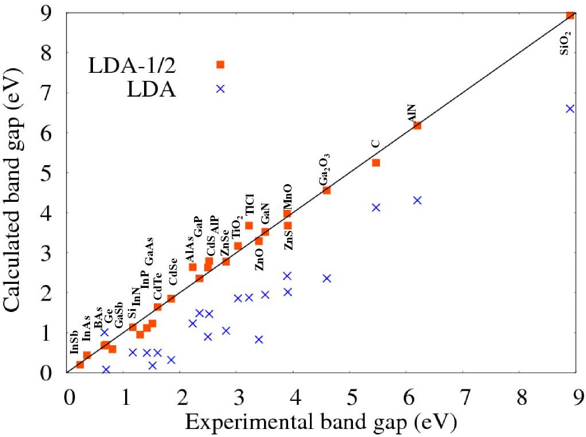
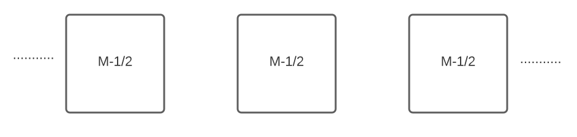

##############
Introduction
##############

The DFT -1/2 method
*********************
DFT-1/2, an alternative way of referring to the LDA -1/2 [1]_ [2]_ and GGA -1/2 [2]_ techniques, 
is a method that method for approximate self-energy corrections within the framework of conventional Kohn-Sham DFT 
which can be used not only with the local density approximation (LDA), but also with the generalized gradient approximation (GGA) [11]_ [2]_ [12]_.

The method aims to predict energy gaps results with the same precision [2]_ as the quasiparticle correction [9]_ algorithm, considered 
the state of the art for calculating energy gap of semiconductors. In addition, the computational effort of the method 
is equivalent to the standard DFT approach, which allows the technique to be applied to complex systems.

   Fig 1. Comparison of calculated band gaps with experiment. The red square are the SCF LDA-1/2 (standard
   LDA-1/2). The crosses are standard LDA. The small gap semiconductors are metals (negative gaps), when calculated with
   LDA. LDA-1/2 corrects the situation. The band structure calculations were made with the codes VASP [13]_ [14]_ and WIEN2k. [15]_ [2]_

What is minushalf?
********************

Minushalf is a command line interface (CLI) developed by the group of semiconductor materials and nanotechnology (`GMSN <http://www.gmsn.ita.br/>`_) that aims to automate 
the application of the DFT -1/2 method. The commands available in this  CLI automate both the entire process and each of its steps in order to be 
used for several purposes.

An intuitive explanation of the DFT -1/2 method
************************************************

DFT-1/2, an alternative way of referring to the LDA -1/2 [1]_ [2]_ and GGA -1/2 [2]_ techniques, 
is a method that performs semiconductor band gap calculations with precision close 
to the state of the art algorithms [2]_. This method aim to expand the half-occupation 
technique [3]_ [4]_ [5]_, formalized by Janak's theorem, to crystals using modern exchange-correlation approaches [6]_ [7]_.

The Slater half-occupation scheme has already proven to be quite efficient for calculating atomic ionization 
energies values close to the experimental ones [5]_. However, this technique cannot be applied blindly to
extended systems like crystals, since the crystal is described by means of Bloch waves and removing the population
of just one Bloch state would have no consequences [1]_. Moreover, removing the population of one Bloch State and set periodic
conditions would result in a infinitely charged system.

Thus, the proposed solution is to apply the Slater procedure to cystaline energy bands. 
The intuition for this application comes from the fact that the energy bands of a crystal are formed
by the overlap of atomic orbitals, mainly by those that constitute the outermost layers [8]_. This relationship can be quantified
by the projection of the wave function in a given orbital, Figure 1 shows the character of the last valence band and the first
conduction band to the CdO, the color magnet represents the character :math:`d` of the band and yellow the character :math:`p` [10]_. Thereby, considering
this existing relationship, self-energy corrections performed in atoms could propagate and shift the energy of the bands, resulting in a band gap correction. 

.. figure:: images/cdo_bands.png
   :width: 500

   Fig 2. Orbital character for CdO valence bands. The character :math:`p` is represented
   in yellow and the character :math:`d` in a magnet [10]_.

How to perform potential correction in crystals
****************************************************

In this section, calculations were developed using some approximations in order to demonstrate
intuitively how the potential correction in crystals is made. To access the rigorous demonstration, consult the references [1]_ [2]_ . 

Following the Slater half occupation procedure for atoms, a change in charge density is required
to obtain the potential for semi-occupation and perform the consistent calculations using the Khon-Shan equation.

Altough in extended systems like crystals a change in charge density in a unit cell would result in an infinitely charged system, which would lead to a 
divergence in the Khon-Shan calculations. Furthermore, it would also be irrelevant to be able to modify only a finite amount of electrons in the crystal since
the charge would become irrelevant to the infinite amount of electrons present in the system. To bypass this problem, it is necessary to find a new way
to derive the semi-occupied potential.

Firstly, one have to define the system that corresponds to the semi-occupied potential for a solid. For an atom containing
:math:`N` electrons in its ground state, the semi-occupied potential is defined as the potential of the atom with :math:`N-\frac{1}{2}` electrons. Similarly, we should 
consider that the semi-occupied potential of a solid would be the potential generated by a solid with :math:`M-\frac{1}{2}` electrons per primitive cell, where :math:`M` is the number of electrons
of the unit cell in the ground state, as shown in Figure 2.

   Fig 3. Scheme representing the unit cells of a solid that would generate the potential semi-occupied.

So, to outline the solution, suppose one have :math:`N` independent charge distributions, where the :math:`mth` is given by:

.. math::
   \rho_{m}(\vec{r}) = (1+f_{m})n_{m}(\vec{r}) \\
   n_{m}(\vec{r}) = -q \cdot \eta_{m} \\
   \int \eta_{m}(\vec{r})d\vec{r} = 1 \\

Where :math:`\rho` represents the density of the distribution :math:`m`, :math:`q` represents the charge of the electron, :math:`\eta` a normalized function in space and :math:`f` represents an occupancy factor that varies continuously from
0(occupied) to -1(unoccupied).

Considering the charge density represented above, one can find the Coulomb potentials for each distribution
by the Poison equation:

.. math::
   \nabla^{2}V_{m}(\vec{r}) = \frac{q\rho_{m}(\vec{r})}{\epsilon_{0}}

Now, suppose another situation where one only alternate the occupation of the :math:`\alpha` level and the same charge distribution remains. In this scenario, the :math:`mth`
potential is given by:

.. math::
   \nabla^{2}V_{m}{'}(\vec{r}) = \frac{q\rho_{m}{'}(\vec{r})}{\epsilon_{0}} \\
   f_{i}=f_{i}{'}, i \neq \alpha \\
   f_{\alpha} \neq f_{\alpha}{'}

Thus, one want to calculate the potential for all distributions, which is obtained by adding
of the potential of all distributions, as shown in the equations below.

.. math::
   \nabla^{2}V(\vec{r}) = \frac{q\sum_{m=1}^{N}\rho_{m}}{\epsilon_{0}} \\
   \nabla^{2}V{'}(\vec{r}) = \frac{q\sum_{m=1}^{N}\rho_{m}{'}}{\epsilon_{0}}

Subtracting these two equations:

.. math::
   \nabla^{2}(V(\vec{r})-V{'}(\vec{r})) = \frac{q(f_{\alpha}-f_{\alpha}{'})n_{\alpha}(\vec{r})}{\epsilon_{0}}

Using the above equation for the specific case of :math:`f_{\alpha} = 0` and :math:`f_{\alpha}{'} = -1/2`, the following equation is obtained:

.. math::
   \nabla^{2}(V(\vec{r})-V{'}(\vec{r})) = \frac{qn_{\alpha}(\vec{r})}{2\epsilon_{0}}\Rightarrow V{'}(\vec{r}) = V(\vec{r}) - V_{\alpha}^{f_{\alpha}=-1/2}

Hence, using the equation above, one can calculate the potential semi-occupied from other potentials, which discards the need for
modify the charge density. For a crystal, the equation is written as follows:

.. math:: 
   V_{crystal}^{-1/2} = V_{crystal} - V_{1/2e}

Where :math:`V_ {crystal}^{- 1/2}` is the potential of the semi-occupied crystal, :math:`V_ {crystal}`
is the potential of the crystal in the ground state and :math:`V_ {1 / 2e}` is the potential of the respective level
occupied with half an electron. 

To generate :math:`V_ {1 / 2e}`, the following equation is used for the atoms that compose the crystal [1]_ [2]_:

.. math::
   V_{1/2e} = (V_{atom} - V_{atom}^{f_{\alpha}=-1/2})\cdot \theta (r)

.. math::
   \theta (r) = \left\{\begin{matrix}
   \theta (r) = A \cdot[1-(\frac{r}{CUT})^{8}]^{3}) , r \leq CUT \\
   \theta (r) = 0 , r > CUT
   \end{matrix}\right.

Where :math:`V_{atom}` is the potential of the atom in the ground state, :math:`V_{atom}^{f_{\alpha}=-1/2}`
is the potential of the atom with the level :math:`\alpha` occupied, :math:`\theta (r)` is a trimming function,
CUT is the cut radius  and A is a scale factor named amplitude.

There is a problem with adding :math:`-V_ {1 / 2e}` to all the atoms of an infinite crystal: the potential will
diverge. :math:`-V_ {1 / 2e}` is a potential of an excess charge of 1/2 proton and has a tail of 0.5/r
that cannot be summed in an infinite lattice. Therefore the tail has to be trimmed by a step function [2]_.
Besides, it is worth mentioning that the values ​​for :math:`CUT` and :math:`A` must not be chosen arbitrarily, by means of variational 
arguments it can be proved that the optimal values ​​for these parameters are those that maximize the band gap of the crystalline system [1]_ [2]_.

Finally, since the atoms repeats in each unit cell, the potential :math:`V_{1/2e}` is periodic, joining this
information with the fact that :math:`V_{crystal}` is periodic, one can conclude that :math:`V_{crystal}^{-1/2}`
is periodic, which implies that the boundary conditions remain periodic and the Khon-Shan calculations can be applied to the system. 

Where to perform semi-occupation? 
**************************************************

There are two types of correction, simple and fractional, and they must be performed in the last valence band (:math:`VBM`) and the first conduction band (:math:`CBM`).
The choice of which correction cannot be made blindly, it requires an analysis of the band's composition. To explain these two corrections, suppose that we have a matrix where the atoms 
of the unit cell are represented as lines and the types of atomic orbitals :math:`(s, p, d, f ...)` as columns , each value :math:`a_{ij}` 
represents, in percentage, how much that orbital :math:`j` of a given atom :math:`i` contributes to the total module of the wave function. 

.. math::
   A = \begin{bmatrix} 
   a_{11} & a_{12} & \dots \\
   \vdots & \ddots & \\
   a_{N1} &        & a_{NK} 
   \end{bmatrix}

Where:

.. math::
   \sum_{i=1}^{N} \sum_{j=1}^{K} a_{ij} = 100

Simple correction
========================
The simple correction method is applied when an index :math:`a_{ij}` mainly represents the
composition of the band, so that the influence of the other orbitals is negligible.
Thus, the correction of half an electron is done only in the orbital :math:`j` of the atom :math:`i`. 

.. _frac_correction:

Fractional correction
=========================
The fractional correction method is applied when different atomic orbitals have a significant influence
in the composition of the band. To distribute half an  electron, a threshold is chosen
:math:`\epsilon`, which represents the minimum value of :math:`a_{ij}` considered in the correction. Given these
values,the half an electron will be divided among the atoms, proportionally to the coefficient :math:`a_{ij}`.

Is conduction band correction always necessary?
======================================================
In many cases, the correction in the valence band already returns satisfactory and close enough results, which rules out the need for an additional correction in the conduction band. 

Final considerations
=============================
After applying the correction, the optimum cut must be found for each corrected atom to, finally,
we find the final value for the gap. 

References
********************

.. [1] L. G. Ferreira, M. Marques, and L. K. Teles, `Phys. Rev. B 78, 125116 (2008) <http://dx.doi.org/10.1103/PhysRevB.78.125116>`_.

.. [2] L. G. Ferreira, M. Marques, and L. K. Teles, `AIP Adv. 1, 032119 (2011) <https://doi.org/10.1063/1.3624562>`_.

.. [3] J.C. Slater and K. H. Johnson, `Phys. Rev. B 5, 844 (1972) <http://dx.doi.org/10.1103/PhysRevB.5.844>`_.

.. [4] J.C. Slater, `Adv. Quantum Chem. 6, 1 (1972) <http://dx.doi.org/10.1016/S0065-3276(08)60541-9>`_.

.. [5] J. C. Slater and J. H. Wood, Int. J. Quant. Chem. Suppl. 4, 3 (1971).

.. [6] J. P. Perdew and A. Zunger, `Phys. Rev. B 23, 5048 (1981) <http://dx.doi.org/10.1103/PhysRevB.23.5048>`_.

.. [7] J. P. Perdew, K. Burke, and M. Ernzerhof, `Phys. Rev. Lett. 77, 3865 (1996) <http://dx.doi.org/10.1103/PhysRevLett.77.3865>`_ .

.. [8] Holgate, Sharon Ann (2009). Understanding Solid State Physics. CRC Press. pp. 177–178. ISBN 978-1-4200-1232-3.

.. [9] G. Onida, L. Reining, and A. Rubio, `Rev. Mod. Phys. 74, 601 (2002) <http://dx.doi.org/10.1103/RevModPhys.74.601>`_.

.. [10] C. A. Ataide, R. R. Pelá, M. Marques, L. K. Teles, J. Furthmüller, and F. Bechstedt `Phys. Rev. B 95, 045126 – Published 17 January 2017 <https://journals.aps.org/prb/abstract/10.1103/PhysRevB.95.045126>`

.. [11] R. R. Pelá, M. Marques, L. G. Ferreira, J. Furthmüller, and L. K. Teles, `Appl. Phys. Lett. 100, 202408 (2012) <https://doi.org/10.1063/1.3624562>`_.

.. [12] I. Guilhon, D. S. Koda, L. G. Ferreira, M. Marques, and L. K. Teles 1, `Phys. Rev. B 95, 045426 – Published 24 January 2018 <https://journals.aps.org/prb/abstract/10.1103/PhysRevB.97.045426>`

.. [13] G. Kresse and J. Furthmüller, `Phys. Rev. B 54, 11169 (1996) <https://doi.org/10.1103/PhysRevB.54.11169>`_.

.. [14] G. Kresse and J. Furthmüller, `Comput. Mater. Sci. 6, 15 (1996) <https://doi.org/10.1016/0927-0256(96)00008-0>`_.

.. [15] P. Blaha, K. Schwarz, P. Sorantin, and S. B. Trickey, `Comput. Phys. Commun <http://dx.doi.org/10.1016/0010-4655(90)90187-6>`_. 59, 399 (1990), see www.wien2k.at.
