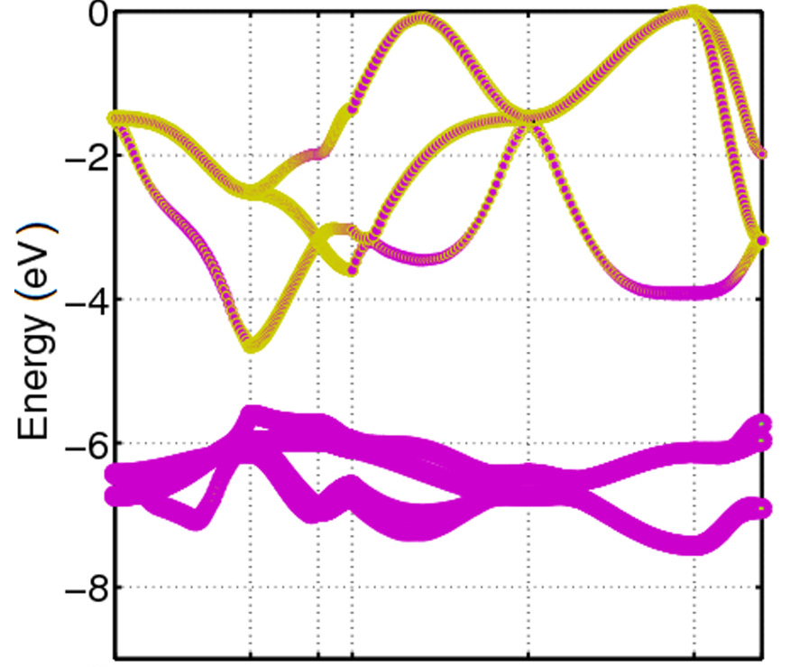

=============
Introduction
=============

What is minushalf?
###################

Minushalf is a CLI developed by GMSN that aims to automate 
the application of the DFT -1/2 method. The commands available in this 
CLI automate both the entire process and each of its steps in order to be 
used by the user for any purposes.

An intuitive explanation of the DFT -1/2 method
##################################################

DFT-1/2, an alternative way of referring to the LDA -1/2 [1]_ [2]_ and GGA -1/2 [2]_ techniques, 
is a method that performs semiconductor band-gap calculations with precision close 
to the state of the art algorithms [2]_. These technique aim to expand the half-occupation 
technique [3]_ [4]_ [5]_, formalized by Janak's theorem, to crystals using modern exchange-correlation approaches [6]_ [7]_.

The Slater half-occupation scheme has already proven to be quite efficient for calculating atomic ionization 
energies values close to the experimental [5]_. However, this technique cannot be applied blindly to
extended systems like crystals, since the crystal is described by means of Bloch waves and removing the population
of just one Bloch state would have no consequences[1]_. Moreover, removing the population of one Bloch State and set periodic
conditions would result in a infinitely charged system.

Thus, the proposed solution is to apply the Slater procedure to cystaline energy bands. 
The intuition for this application comes from the fact that the energy bands of a crystal are formed
by the overlap of atomic orbitals, mainly by those that constitute the outermost layers [8]_. This relationship can be quantified
by the projection of the wave function in a given orbital, Figure 1 shows the character of the last valence band and the first
driving to the CdO, the color magnet represents the character :math:`d` of the band and yellow the character :math:`p` [10]_. Thereby, considering
this existing relationship, self-energy corrections performed in atoms could propagate and shift the energy of the bands, resulting in a band gap correction. 

   Orbital character for CdO valence bands. The character :math:`p` is represented
   in yellow and the character :math:`d` in a magnet [10]_.

How to perform potential correction in crystals
###################################################

Following the Slater half occupation procedure, a change in charge density is necessary to obtain the potential for 
half occupation, however a change in charge density in a unit cell would result in an infinitely charged system, which would lead to a 
divergence in the Khon-Shan calculations. Furthermore, it would also be irrelevant to be able to modify only a finite amount of electrons in the crystal since
the charge would become irrelevant to the infinite amount of electrons present in the system. To bypass
this problem, approximations are used in order to make it possible to calculate the potential for the half occupation of the
crystal through other potentials [1]_ [2]_, as shown in the equation below: 

.. math:: 
   V_{crystal}^{-1/2} = V_{crystal} - V_{1/2e}

Where :math:`V_ {crystal}^{- 1/2}` is the potential of the half-occupied crystal, :math:`V_ {crystal}`
is the potential of the crystal with the standard occupation and :math:`V_ {1 / 2e}` is the potential of the respective level
occupied with half an electron. 

To generate :math:`V_ {1 / 2e}`, the following equation is used for the atoms that compose the crystal [1]_ [2]_:

.. math::
   V_{1/2e} = (V_{atom} - V_{atom}^{f_{\alpha}=-1/2})\cdot \theta (r)

.. math::
   \theta (r) = \left\{\begin{matrix}
   \theta (r) = A \cdot[1-(\frac{r}{CUT})^{8}]^{3}) , r \leq CUT \\
   \theta (r) = 0 , r > CUT
   \end{matrix}\right.

Where :math:`V_{atom}` is the potential of the atom with the standard occupation, :math:`V_{atom}^{f_{\alpha}=-1/2}`
is the potential of the atom with the level :math:`\alpha` occupied, :math:`\theta (r)` is a cutting function,
CUT is the radius of cut and A is a scale factor named amplitude.

The need to have a cutting function is due to the fact that an artificial charged system is generated, therefore the correction
in a cell it generates an  potential that reaches neighboring cells, which would lead to a divergence in the Khon-Shan calculations.
It is worth mentioning that the values ​​for :math:`CUT` and :math:`A` must not be chosen arbitrarily, by means of variational 
arguments it can be proved that the optimal values ​​for these parameters are those that maximize the Gap of the crystalline system [1]_ [2]_.

Finally, since the atoms are repeated in each unit cell, the potential :math:`V_{1/2e}` is periodic, joining this
information with the fact that :math:`V_{crystal}` is periodic, it has the implication that :math:`V_{crystal}^{-1/2}`
is periodic, which implies that the boundary conditions remain periodic. 

Where to perform the half occupation? 
############################################

There are two types of correction, simple and fractional, and they must be performed in the last valence band (:math:`VBM`) and the first conduction band (:math:`CBM`).
The choice of which correction cannot be made blindly, it requires an analysis of the band's composition. To explain these two corrections, suppose that we have a matrix where the atoms 
of the unit cell are represented as lines and the types of atomic orbitals :math:`(s, p, d, f ...)` as columns , each value `a_{ij}` 
represents, in percentage, how much that orbital :math:`j` of a given atom :math:`i` contributes to the total module of the wave function. 

.. math ::
   A = \begin{bmatrix} 
   a_{11} & a_{12} & \dots \\
   \vdots & \ddots & \\
   a_{N1} &        & a_{NK} 
   \end{bmatrix}

Where:

.. math ::
   \sum_{i=1}^{N} \sum_{j=1}^{K} a_{ij} = 100

Simple correction
********************
The simple correction method is applied when an index :math:`a_{ij}` mainly represents the
composition of the band, so that the influence of the other orbitals is negligible.
Thus, the correction of half an electron is done only in the orbital :math:`j` of the atom :math:`i`. 

.. _frac_correction:

Fractional correction
************************
The fractional correction method is applied when different atomic orbitals have a significant influence
in the composition of the band. To distribute the electron medium, a threshold is chosen
:math:`\epsilon`, which represents the minimum value of :math:`a_{ij}` considered in the correction. Given these
values, half an electron will be divided among the atoms, proportionally to the coefficient :math:`a_{ij}`.

Is conduction band correction always necessary?
********************************************************
In many cases, the correction in the valence band already returns satisfactory and close enough to the 
experimental results, which rules out the need for an additional correction in the conduction band. 

Final considerations
***********************
After applying the correction, the optimum cut and amplitude must be found for each corrected atom to, finally,
we find the final value for the gap. 

DFT -1/2 results
###################

The results obtained by the application the method has the same precision [2]_ as the GW [9]_ algorithm ,as shown in Figure 2, considered 
the state of the art for calculating the band-gap of semiconductors. In addition, the computational complexity of the method 
is equivalent to calculating the Khon-Shan gap, which allows the technique to be applied to complex systems.

References
###########

.. [1] L. G. Ferreira, M. Marques, and L. K. Teles, `Phys. Rev. B 78, 125116 (2008) <http://dx.doi.org/10.1103/PhysRevB.78.125116>`_.

.. [2] L. G. Ferreira, M. Marques, and L. K. Teles, `AIP Adv. 1, 032119 (2011) <https://doi.org/10.1063/1.3624562>`_.

.. [3] J.C. Slater and K. H. Johnson, `Phys. Rev. B 5, 844 (1972) <http://dx.doi.org/10.1103/PhysRevB.5.844>`_.

.. [4] J.C. Slater, `Adv. Quantum Chem. 6, 1 (1972) <http://dx.doi.org/10.1016/S0065-3276(08)60541-9>`_.

.. [5] J. C. Slater and J. H. Wood, Int. J. Quant. Chem. Suppl. 4, 3 (1971).

.. [6] J. P. Perdew and A. Zunger, `Phys. Rev. B 23, 5048 (1981) <http://dx.doi.org/10.1103/PhysRevB.23.5048>`_.

.. [7] J. P. Perdew, K. Burke, and M. Ernzerhof, `Phys. Rev. Lett. 77, 3865 (1996) <http://dx.doi.org/10.1103/PhysRevLett.77.3865>`_ .

.. [8] Holgate, Sharon Ann (2009). Understanding Solid State Physics. CRC Press. pp. 177–178. ISBN 978-1-4200-1232-3.

.. [9] G. Onida, L. Reining, and A. Rubio, `Rev. Mod. Phys. 74, 601 (2002) <http://dx.doi.org/10.1103/RevModPhys.74.601>`_.

.. [10] C. A. Ataide, R. R. Pelá, M. Marques, L. K. Teles, J. Furthmüller, and F. Bechstedt `Phys. Rev. B 95, 045126 – Published 17 January 2017 <https://journals.aps.org/prb/abstract/10.1103/PhysRevB.95.045126>`